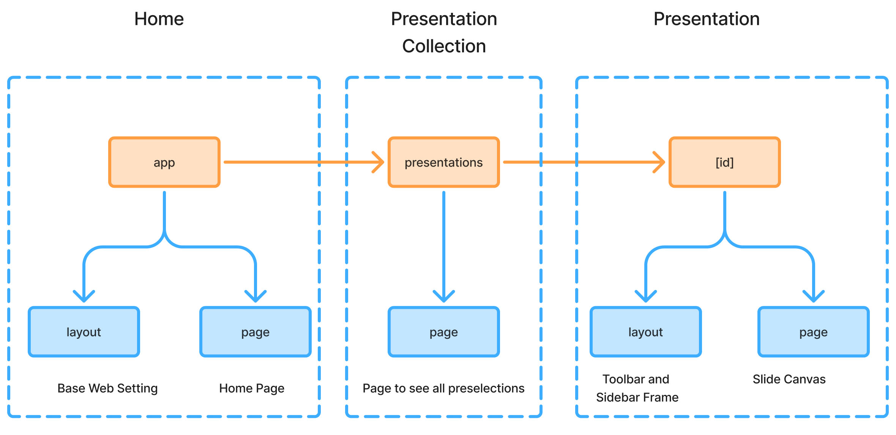
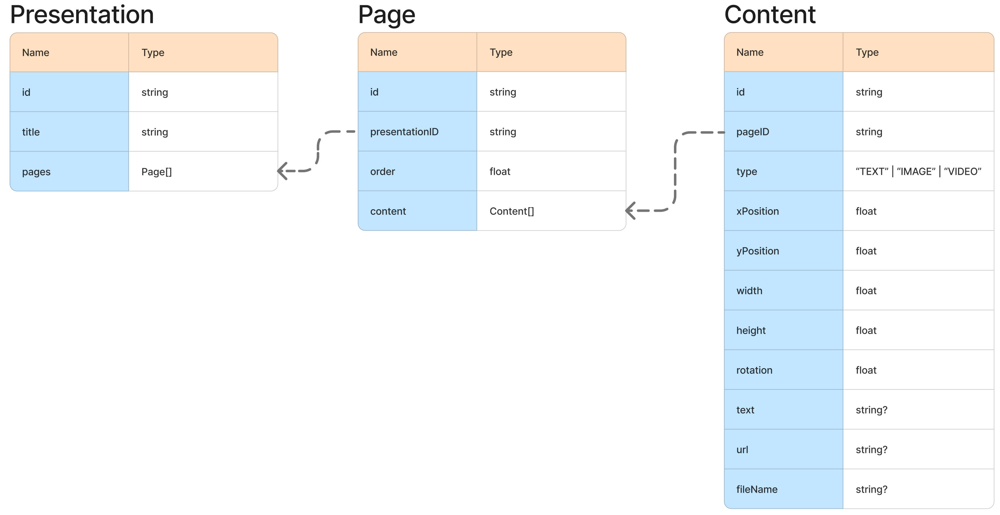

# Online Slide

A simple full-stack web application that allows users to create presentations, manage pages, and edit content similar to PowerPoint.

## Features Implemented

### Presentations

- List all presentations
- Create new presentations
- Delete presentations

### Pages

- List all pages
- Add and delete pages
- save pages online

### Content Editing

- Add text, images, or videos to a page
- Drag and move content anywhere within the page
- Resize and rotate content

## Getting Started

Try the live demo on Vercel:
[http://online-slide.vercel.app](http://online-slide.vercel.app)

### 1. Clone the Repository

```bash
#first
git clone https://github.com/YuZhang-steven/online-slide.git
#then
cd online-slide
```

### 2. Run the development server

```bash
# using npm
npm install
npm run dev

# using yarn
yarn install
yarn dev

# using pnpm
pnpm install
pnpm dev

# using bun
bun install
bun dev
```

Open [http://localhost:3000](http://localhost:3000) in your browser.

### 3. Environment Variable

The project uses a cloud-hosted PostgreSQL database and Cloudflare R2 for storing images and videos.
Create .env in the project root:

```ini
BASE_URL=
POSTGRES_URL=
R2_ACCESS_KEY_ID=
R2_SECRET_ACCESS_KEY=
R2_BUCKET_NAME=
R2_ENDPOINT=
R2_PUBLIC_URL=
```

## Tech Stack

### Backend

Next.js API routes
TypeScript – Shared domain types
Zod – Runtime validation + schema inference
Prisma – Type-safe ORM for database access
PostgreSQL – Relational data persistence
Cloudflare R2 – Object storage for images/videos

### Frontend

Next.js – React framework + routing
TypeScript – strict typing
Zustand – Lightweight global state management
Konva / react-konva – canvas-based editor for drag/resize/rotate
use-image – Image loading helper for Konva
TailwindCSS – Utility-first styling
Shadcn/UI – Reusable, accessible UI components

## Project Structure

### Basic Folder Structures

```text
app/                # Next.js App Router pages & API routes
action/             # Server Actions for data fetching and mutations
components/         # Reusable UI components (Shadcn, editor UI, etc.)
lib/                # Shared utilities: helpers, server logic, Zod schemas
prisma/             # Prisma schema & client
public/             # Static assets
```

### Route Structures



### API Overview

```text
/api/presentations
    GET  → fetch all presentations
    POST → create a new presentation

/api/presentations/:id
    GET  → get a presentation by id
    DELETE → delete a presentation

/api/presentations/:id/pages
    POST → create a new page in a presentation
    GET  → get a page with all its contents
    DELETE  → delete a page and its contents
    PUT  → update a page and its contents

/api/upload
    POST → upload objects to R2 Bucket

```

## Design Notes

This project is built using the Next.js App Router. The app is divided into two main parts:

1.The presentation list
2. The single-presentation editor

All presentations, pages, and content items are stored in the database. Images and videos are uploaded to Cloudflare R2.  

### Data Model



The database includes three entities: Presentation, Page, and Content.These form a strict one-to-many relationship chain.

Design considerations:

- Pages use a float “order” value (e.g., 1.1, 1.113, 1.23).This allows inserting pages without reordering the entire sequence. The frontend sorts pages and derives indices.
- Content positions and sizes are stored as floats, matching Konva’s coordinate system.
- Text content is stored directly in the database; image and video content stores the corresponding R2 URLs.

### Backend

PostgreSQL is used as the main database because the data is relational and benefits from strong consistency.Images and videos are stored in Cloudflare R2 for fast access and potential future streaming capability.

In addition to REST API endpoints, there are a few server-side helper functions used during server-side rendering:

- addNewPage
- fetchAllPages
- fetchAllPresentations

### Frontend

The core of the presentation editor is a 2D canvas powered by Konva, which provides built-in dragging, rotation, and resizing.

State management design:

- pageMap stores all pages and their associated content IDs
- contentMap stores all content objects by ID
- deletedContentSet tracks content removed locally but not yet persisted

- Global state tracks:
-- the current page
-- the content IDs shown on the canvas

When loading a page, the app fetches its contents and add them to the maps.In the canvas component, content IDs are organized into arrays by type then send into global state.

Each content modification is stored locally and the content map.
When the user saves the page, all changes are batch-uploaded to the database.

### Limitation and Future Improvement

- Delete and copy/paste are not fully implemented.(Requires clearer UI and global selection state.)
- Undo/Redo requires a history stack for content operations.
- Video handling could be improved.In many cases, linking to YouTube might be more efficient depending on network conditions.
- Add a configuration model for content styles (text style, image settings, etc.)and another style/config models for pages and presentations as well
